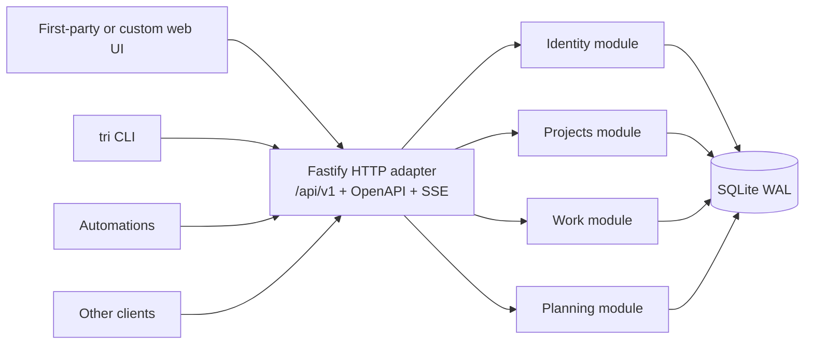

# Triathlon v2 Backend Design

**Status:** Accepted  
**Date:** 2026-09-07

## Outcome

Triathlon v2 is a backend-first, self-hosted work tracker for small teams. The backend is the product: the existing web UI, the `tri` CLI, automations, and user-built interfaces are replaceable clients of one public HTTP interface.

V2 preserves projects, one board per project, tickets, comments, relationships, review, sprints, metrics, users, and access keys. It removes Convex, the whiteboard, and the separate agent gateway.

## Deployment constraints

- Primary host: 64-bit Raspberry Pi 4B.
- Maximum expected concurrency: seven people or automations.
- Shape: single-node modular monolith; one server process and one SQLite database.
- Durable dependencies: SQLite database and backup files only.
- Distribution: versioned Linux ARM64/AMD64 OCI images, Docker Compose example, and direct Node.js release.
- Network: HTTP behind an operator-managed trusted reverse proxy; no built-in TLS.
- External dependencies: none required at runtime; the server works offline and emits no telemetry.
- Performance target: ten thousand tickets and five hundred thousand Activity records, with normal indexed operations below 500 ms at p95. Large histories and Closed tickets are paginated.

## Non-goals

- Whiteboard or Excalidraw.
- Uploaded files, avatars, or ticket attachments.
- Convex compatibility or data migration.
- A separate agent gateway.
- MCP support in v2.
- Multiple boards per project.
- Custom roles or granular key capabilities.
- PostgreSQL until SQLite fails under observed needs.
- Multi-node operation, Kubernetes, serverless deployment, or high availability.
- Built-in TLS, SMTP, telemetry, or hosted cloud dependencies.

## Architecture



The four domain modules expose small interfaces and own their invariants. Fastify is an adapter at the external seam. Routes authenticate, validate, invoke a module interface, and translate results; business rules never live only in HTTP, CLI, or frontend code.

Kysely and SQLite remain internal implementation details. There is no repository interface per table. Module tests cross the same interfaces as callers and use isolated real SQLite databases.

### Identity module

Owns:

- Secure first-owner bootstrap.
- Better Auth email/password users and browser sessions.
- User suspension and password recovery.
- Instance Owner and Instance Admin status.
- Project invitations.
- User-owned and Automation-owned access keys.
- Automation ownership and transfer.
- Authentication context and security Audit records.

### Projects module

Owns:

- Project creation, soft deletion, restoration, and permanent purge.
- Immutable creator and transferable current owner.
- Membership and member removal.
- One board per project.
- Ordered workflow columns and their semantic categories.
- Project timezone.
- Project authorization decisions.

### Work module

Owns:

- Tickets and per-project sequential ticket numbers.
- Explicit position within a column and atomic board reordering.
- Comments and structured Activity history.
- Blocking and parent-of relationships.
- Ticket revisions and review records.
- Move, Resolve, Reopen, soft deletion, and restoration.
- Frontier calculation.

### Planning module

Owns:

- Sprint lifecycle and actual timing.
- Current and historical sprint membership.
- Provisional metric calculation.
- Immutable completion snapshots.

## Identity and authorization

### Bootstrap and accounts

`triathlon init` generates a short-lived, single-use local setup URL/code. Redeeming it within 30 minutes creates the first Instance Owner and permanently closes bootstrap registration. Every later account requires a valid project invitation.

Invitations use one token that can be entered as a code or embedded in a shareable URL. They are project-scoped, reusable until revoked or expired, default to seven days, and may explicitly be non-expiring. No email delivery or verification is required.

Browser sessions last 30 days by default and are revoked on password reset or suspension. Authenticated users can change their password. An Instance Admin can create a 30-minute, single-use reset URL/code. Accounts may be suspended but are never permanently deleted.

### Roles

| Capability | Instance Owner | Instance Admin | Project Owner | Project Member |
|---|---:|---:|---:|---:|
| Read the security Audit log | Yes, exclusively | No | No | No |
| Appoint or revoke Instance Admins | Yes | No | No | No |
| Transfer Instance ownership | Yes | No | No | No |
| Create projects | Yes | Yes | No | No |
| Issue instance-wide keys | Yes | Yes | No | No |
| Recover project ownership | Yes | Yes | No | No |
| Permanently purge deleted tickets/projects | Yes | Yes | No | No |
| Rename/delete/configure owned project | If owner | If owner | Yes | No |
| Invite project members | If owner | If owner | Yes | No |
| Manage project tickets and sprints | If member | If member | Yes | Yes |
| Create project-scoped keys | If member | If member | Yes | Yes |

A project has exactly one owner. Initial ownership belongs to the Instance Admin who creates it. Ownership may transfer only to an existing member; the old owner becomes a member. A non-admin Project Owner may administer that project but cannot create another project.

Instance ownership may transfer only to an existing Instance Admin. The previous owner remains an admin, Audit visibility moves to the new owner, and the current owner cannot be suspended or demoted.

Removing a project member atomically unassigns their Open tickets, disables their project-scoped access, and records the change. Historical tickets, comments, reviews, Closed assignments, and completed metrics retain attribution.

### Access keys and Automations

One access-key mechanism serves human tools and Automations:

- A user-owned key authenticates as that user.
- An Automation belongs to one user and inherits that user's permissions.
- Project work and Activity attribute Automation requests to the owning person.
- The owner-only Audit log additionally identifies the Automation, access key, and untrusted client header.
- `X-Triathlon-Client` may describe `web`, `cli`, `agent`, `custom`, or another caller, but grants no authority.
- Project-scoped keys may be non-expiring and cannot escape their project.
- Instance-wide keys may be issued only by an Instance Admin, expire within 90 days, and grant ordinary member-level work access to every current and future project. They never grant project administration.
- Key secrets are shown once, stored only as secure digests, individually named, optionally expiring, and revocable.
- Automation ownership may transfer without rewriting historical Audit attribution.

Only the Instance Owner can read Audit records. Entries include credential, Automation, client metadata, operation, target references, result, timestamp, and request ID, but never secrets or full sensitive bodies.

## Projects and boards

Only Instance Admins create projects. Each project receives one board with this default workflow:

| Column | Category |
|---|---|
| Backlog | `not_started` |
| Todo | `not_started` |
| In Progress | `started` |
| Review | `started` |
| Done | `done` |

Column names and order do not define behavior. Exactly one column has category `done`; any number may be `not_started` or `started`.

Only the Project Owner may rename, reorder, add, delete, or recategorize columns. Deleting a non-empty column requires an atomic destination for its tickets. Changing the Done column is an explicit workflow migration that reports affected tickets and requires confirmation; the board may never have zero or multiple Done columns.

Project soft deletion immediately disables project-only keys and hides the project. The owner may restore it. An Instance Admin may permanently purge deleted projects and tickets, but never users.

Each project has an IANA timezone, defaulted from the instance. Changing it affects active and future daily calculations and is recorded in Activity; completed metric snapshots remain unchanged.

## Tickets and workflow

A ticket has:

- UUIDv7 machine identifier.
- Immutable, never-reused, sequential number within its project.
- Required title up to 200 characters.
- Markdown description up to 64 KiB, defaulting to empty.
- Optional bounded non-negative integer story points; absence differs from zero.
- `low`, `medium`, or `high` priority, defaulting to `medium`.
- Up to 50 trimmed, lowercase labels of up to 50 characters each.
- At most one human assignee.
- One column and an explicit position within it.
- Integer resource version and ticket revision.

UUIDv7 is canonical for writes and relationships. Project-scoped lookup by ticket number is supported and displayed as `#42`; v2 has no Jira-style project key.

### Movement and closure

- Move changes an Open ticket's column or position but cannot cross the Done boundary.
- Resolve requires an approved current revision and an outcome comment, then atomically moves the ticket into Done.
- Reopen is explicit, chooses a destination, creates a new revision, invalidates approval, and leaves Done.
- The first-party UI confirms Reopen before sending it; the explicit command carries intent for other clients.

Done column membership is the only source of Closed state. There is no separate status field.

### Review

Every ticket revision follows `unreviewed → requested → approved | rejected`. A current approval is mandatory before Resolve. Any authorized user may request or decide review, including their own work; an Automation may make the request under its owner's authority. Rejection requires a comment; approval may include one.

Changes to title, description, points, priority, labels, assignee, parent, or blockers create a new ticket revision and invalidate earlier approval. Comments, sprint assignment, and Open-column movement do not. Reopen always creates a revision.

Review requests and decisions are immutable historical records rather than one overwritten status value.

### Comments, links, deletion, and Frontier

Comments are immutable and limited to 64 KiB. Corrections are new comments.

Blocking and parent-of edges stay within one project and reject cycles. A ticket has at most one parent and any number of children. Deleted tickets and their links remain historical but exert no blocking effect.

Ticket deletion creates a restorable tombstone and removes it from normal queries. Restore returns its prior column, position, relationships, sprint association, revision, and review state. A restored Closed ticket remains Closed. Ticket numbers are never reused, and completed sprint snapshots never change.

Frontier is the Open, unassigned set whose blockers are all Closed. Deleted blockers do not block.

## Sprints and metrics

Sprints transition only `planned → active → completed`. A project has at most one active sprint. Activating another returns `ACTIVE_SPRINT_EXISTS`; it never silently demotes the active sprint. Planned sprints may be deleted. Completed sprints and snapshots are immutable.

A ticket belongs to at most one planned or active sprint while retaining any number of historical completed memberships. Active scope may change, with each addition, removal, and estimate change recorded. Completion freezes membership and metrics. Unfinished tickets remain in their board columns, lose current sprint assignment, and may enter another sprint while preserving completed-sprint history.

Planned dates guide scheduling. Explicit activation and completion timestamps define the measured interval. State changes may occur outside planned dates. Daily metrics use the project timezone.

Metrics are:

- Velocity: completion-time points on qualifying tickets.
- Throughput: count of qualifying tickets.
- Lead time: creation to qualifying close.
- Cycle time: most recent transition from `not_started` into any `started` column until qualifying close; movement among started columns does not reset it.
- Burndown: project-local end-of-day remaining points, including scope and estimate changes.
- Completed per day: tickets grouped by their final qualifying close.

A qualifying ticket closed during the actual sprint interval, while belonging to that sprint, and its approved revision remains Closed when the sprint completes. Adding already completed work does not inflate metrics. Active metrics are provisional; completion snapshots never change afterward.

## Activity, transactions, and live updates

Every successful command uses one SQLite transaction to:

1. Validate authorization and invariants.
2. Change domain state.
3. Append a structured Activity record with relevant before/after values.
4. Store any idempotency result.
5. Allocate a monotonic project event sequence.

Activity is permanent and visible to project members. It attributes Automation work to the owning person. Audit is separate, security-oriented, and visible only to the Instance Owner.

SSE exposes an ordered stream per project. Events contain sequence, event ID, event type, schema version, project ID, timestamp, person-level actor, resource references, and structured change data. Clients resume with `Last-Event-ID` and safely ignore unknown event types. Instance-wide credentials subscribe to projects explicitly; there is no instance firehose.

## HTTP interface

- Base path: `/api/v1`.
- Auth path: `/api/auth/*` through standalone Better Auth.
- Format: JSON over HTTP, plus project-scoped SSE.
- Documentation: public OpenAPI JSON; configurable interactive documentation UI.
- Browser security: cookie sessions, CSRF protection, and an explicit trusted-origin allowlist.
- Non-browser security: bearer access keys.
- Errors: one Problem Details-style envelope with HTTP status, stable domain code, request ID, human message, and optional field errors.
- Concurrency: integer resource versions and expected-version preconditions.
- Retry safety: `Idempotency-Key` scoped to credential, method, and route for seven days. Same normalized input returns the original result; different input returns `IDEMPOTENCY_CONFLICT`.
- Pagination: cursor-based with explicit filters and sort order.
- Compatibility: v1 permits additive changes only. Breaking changes require a new major path and one documented overlap release.

Deep composite reads include project summary, board snapshot, Frontier, ticket detail with comments/links/review, and sprint metrics. They are available to every authorized client.

An authenticated capabilities endpoint reports server/API version, user identity, credential identity, untrusted client metadata, effective scope, accessible projects, and enabled features. It returns no secrets.

Fastify TypeBox/JSON Schemas are the transport source of truth. They generate a checked-in OpenAPI document, which generates the optional TypeScript client. CI rejects stale generated artifacts.

## Technology and repository

- Runtime: Node.js and TypeScript.
- HTTP: Fastify with TypeBox/JSON Schema and OpenAPI generation.
- Persistence: Kysely with `better-sqlite3`, WAL mode, foreign keys, and explicit ordered migrations.
- Authentication: standalone Better Auth using the same SQLite database.
- Package management: npm workspaces.

```text
apps/
  server/       backend product and local triathlon executable
  web/          optional first-party frontend
packages/
  client/       generated TypeScript HTTP client
  cli/          remote tri CLI
```

Migration files are immutable once released and are the database schema source of truth. A migrated development database generates checked-in Kysely database types.

The application entry point constructs configuration, database, auth, clock, ID generator, and modules explicitly. There is no dependency-injection container. Only genuinely variable dependencies such as clock, IDs, and randomness receive test adapters.

The first-party web app replaces Convex hooks with one frontend adapter around the generated client. That adapter owns sessions, caching, optimistic changes, and SSE invalidation; page code remains transport-agnostic and preserves the existing UI except Whiteboard.

`tri` remains a remote public-interface client with useful command compatibility, `--json`, stable exit codes, generated idempotency keys, and identity/project discovery. `triathlon` is a separate local administrative executable for init, configuration checks, migrations, backup, restore, integrity checks, and serving.

## Operations

Configuration uses one validated YAML file with environment overrides for individual settings and secrets. A command prints resolved configuration with secrets redacted.

The default container entrypoint locks migration, creates a pre-migration backup, applies forward migrations, and starts serving. Local commands include `migrate`, `migrate --check`, and `serve --no-migrate`. Older application code refuses a newer database schema.

Online backup, restore, and integrity-check commands operate on standard SQLite files. An optional schedule defaults to seven daily and four weekly backups in a mounted directory. Backups are not application-encrypted; filesystem permissions, encrypted disks, and off-device copies are operator concerns.

Operational logs are structured on stdout/stderr with levels and request IDs. Passwords, cookies, authorization headers, invitation/reset codes, and access keys are redacted. Lightweight local rate limits protect authentication, invitation, reset, and invalid-key endpoints without Redis.

Unauthenticated liveness and readiness endpoints expose no sensitive information. Lightweight maintenance runs inside the server process with database locks and cleans expired invitations, reset codes, sessions, rate-limit records, and seven-day idempotency records.

## Verification

- Module-interface tests with isolated real SQLite databases.
- HTTP/OpenAPI contract tests.
- Full authorization matrix for sessions, project keys, and instance-wide keys.
- Review revision, relationship-cycle, deletion/restore, and sprint invariant tests.
- Activity transaction, SSE reconnect, concurrency, and idempotency tests.
- Migration tests from every released schema version.
- Backup/restore and integrity tests from release images.
- Generated OpenAPI/client freshness checks.
- Small end-to-end suite through the first-party UI.
- ARM64 smoke test on a Pi 4B or equivalent hardware.

## Delivery and cutover

1. Build server configuration, SQLite migrations, health checks, and secure owner bootstrap.
2. Deliver Identity and Projects through HTTP with authorization tests.
3. Deliver Work through HTTP with Activity, SSE, generated client, and `tri`.
4. Deliver Planning and frozen metrics.
5. Deliver backups, local rate limiting, release images, and Pi verification.
6. Replace the existing frontend data layer and reach parity except Whiteboard.
7. Remove Convex, whiteboard code and dependencies, the old gateway, and stale agent documentation in one clean cutover.

This design was confirmed as shared understanding on 2026-09-07.
